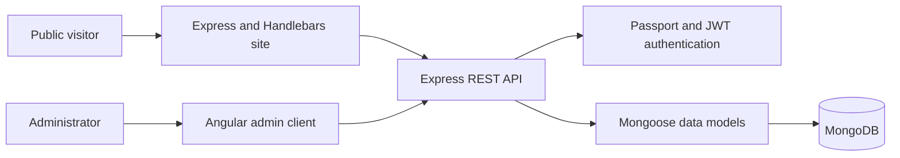

# Travlr Getaways Full-Stack Application

[](https://github.com/PhantomOSG-25/CS-465-Full-Stack-Development/actions/workflows/test.yml)

**Node.js · Express · MongoDB · Mongoose · REST API · Angular · JWT authentication**

Travlr Getaways is a full-stack travel application developed from a client scenario. It combines a public, server-rendered travel site with an Angular administrative interface for authenticated trip management.

This maintained portfolio version emphasizes the work behind the interface: application architecture, database integration, RESTful operations, authentication, client/server coordination, validation, testing, configuration, and troubleshooting.

## Problem and contribution

The client needed two related experiences:

- A public website where visitors can view available trips.
- An administrative single-page application where authorized users can add, edit, and delete trip records.

My work connected those experiences to a shared Express and MongoDB backend. I implemented and refined the API, Mongoose models, database lifecycle, authentication flow, route protection, Angular services and forms, configuration handling, and project documentation. I also corrected functional and security problems identified during portfolio review, including inconsistent trip identifiers, an unusable seed script, hardcoded client endpoints, unguarded admin routes, duplicated authentication setup, and fragile token handling.

Course-provided foundations and the maintained contribution boundary are identified in [ATTRIBUTION.md](ATTRIBUTION.md).

## Architecture



More detail is available in [docs/ARCHITECTURE.md](docs/ARCHITECTURE.md).

## Capabilities

- Public server-rendered pages for travel content.
- REST endpoints for listing and retrieving trips.
- Authenticated create, update, and delete operations.
- Mongoose schemas and MongoDB persistence.
- Local authentication with salted PBKDF2 password hashes.
- Signed JWTs with expiration and guarded administrative routes.
- Angular reactive forms for trip creation and editing.
- Original responsive presentation for the public and administrative experiences.
- Environment-controlled database, signing-secret, origin, and service configuration.
- Seed data for a repeatable local demonstration.
- Backend model, API integration, and seed-data tests plus an Angular build/test workflow.

## Repository guide

| Path | Purpose |
| --- | --- |
| `app.js`, `bin/www` | Express application and HTTP entry point |
| `app_api` | REST routes, controllers, authentication, and Mongoose models |
| `app_server` | Server-rendered Handlebars routes, controllers, and views |
| `app_admin` | Angular administrative single-page application |
| `data/trips.json` | Demonstration trip seed data |
| `public` | Original public-site styling and portfolio-specific travel imagery |
| `test` | Backend model and seed-data checks |
| `docs` | Architecture and design notes |

## Local setup

### Prerequisites

- Node.js 20.19 or later
- npm 10 or later
- MongoDB running locally or an approved development MongoDB connection

### 1. Configure the server

Copy `.env.example` to `.env` and replace the placeholder signing secret:

```bash
cp .env.example .env
```

Required settings:

- `MONGODB_URI` — development MongoDB connection string
- `JWT_SECRET` — long, randomly generated signing secret
- `CLIENT_ORIGIN` — allowed Angular client origin when it runs separately
- `ADMIN_BASE_URL` — administrative client URL used by the public navigation
- `API_BASE_URL` — URL used by the server-rendered site to reach the API
- `ALLOW_REGISTRATION` — enables the course registration endpoint only when explicitly set to `true`

Never commit `.env` or real credentials.

### 2. Install, seed, and start the backend

```bash
npm ci
npm run seed
npm start
```

The public site and API use `http://localhost:3000` by default.

### 3. Start the Angular admin client

In a second terminal:

```bash
cd app_admin
npm ci
npm start
```

The development client uses `http://localhost:4200` and proxies `/api` requests to the Express server.

## Verification

Backend checks:

```bash
npm test
```

The backend suite starts an isolated in-memory MongoDB instance and verifies the public site, authentication, authorization, and the complete trip create/update/delete lifecycle. The first run may download a local MongoDB test binary; it does not use or change a developer database.

Angular checks:

```bash
cd app_admin
npm test -- --watch=false
npm run build
```

GitHub Actions runs the backend integration tests and Angular checks for pushes and pull requests. These checks do not replace deployment-specific configuration, security, and browser review.

## Security approach

- Secrets are read from the environment and excluded from version control.
- Passwords are salted and hashed with PBKDF2 rather than stored directly.
- Password comparisons use a timing-safe operation.
- JWT signing fails closed when `JWT_SECRET` is missing.
- Administrative write endpoints require a valid token.
- Angular add/edit routes require an authenticated session.
- Public self-registration is disabled by default.
- Cross-origin access is limited to the configured client origin.

See [SECURITY.md](SECURITY.md) for deployment limitations and responsible reporting guidance.

## Current limitations

This is a maintained academic portfolio project, not a production travel service.

- Full behavior requires MongoDB and the two local application processes.
- Automated checks cover the data models, isolated MongoDB/API integration, authentication and authorization, seed data, Angular tests, and compilation. A deployed environment still needs its own browser and operational verification.
- Rate limiting, centralized validation, production session strategy, audit logging, and deployment infrastructure would be required before a real administrative deployment.
- Portfolio imagery was generated specifically for this maintained version and is documented in [docs/VISUAL-ASSETS.md](docs/VISUAL-ASSETS.md).

## Skills demonstrated

Full-stack JavaScript development, Node.js, Express, Angular, TypeScript, MongoDB, Mongoose, REST API design, authentication, JWT authorization, configuration management, debugging, testing, application security, client/server integration, and technical documentation.

## Author

Michael B. Wood<br>
Bachelor of Science in Computer Science, Software Engineering concentration<br>
Southern New Hampshire University · Coursework completing August 2026
