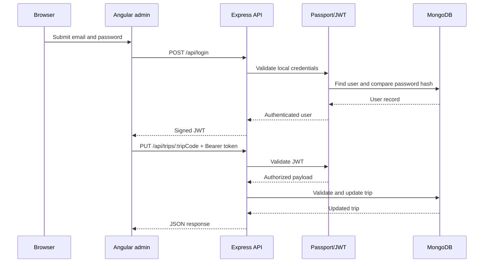

# Application Architecture

## Components

### Public web application

Express serves the public pages and Handlebars templates. The travel controller retrieves trip records from the shared REST API rather than maintaining a second data-access implementation.

### REST API

The API exposes public read operations and token-protected write operations. Controllers translate HTTP requests into Mongoose model operations and return JSON responses.

| Method and route | Purpose | Authentication |
| --- | --- | --- |
| `GET /api/trips` | List trips | Public |
| `GET /api/trips/:tripCode` | Retrieve one trip | Public |
| `POST /api/trips` | Add a trip | JWT required |
| `PUT /api/trips/:tripCode` | Update a trip | JWT required |
| `DELETE /api/trips/:tripCode` | Delete a trip | JWT required |
| `POST /api/login` | Authenticate an administrator | Public |
| `POST /api/register` | Development-only registration | Disabled unless configured |

### Data layer

Mongoose defines trip and user schemas and connects to MongoDB through `MONGODB_URI`. Trip codes are stable business identifiers used consistently by the API and Angular client.

### Authentication

Passport Local validates an email and password against the stored user record. Passwords use a per-user random salt and PBKDF2-SHA512 hash. Successful login returns a signed, expiring JWT. Express middleware validates that token before allowing data changes.

### Angular administration client

The Angular client lists trips publicly and exposes add, edit, and delete controls to an authenticated administrator. An HTTP interceptor attaches the JWT to protected requests, and route guards prevent anonymous navigation to editing forms.

## Runtime flow

## Configuration boundaries

- `.env` is local and ignored.
- `.env.example` contains only non-secret examples.
- The Angular development proxy keeps client API requests relative.
- The server-rendered application uses `API_BASE_URL` so its API location is not hardcoded in controller logic.

## Verification boundaries

Automated checks validate model behavior, seed-data structure, authentication and authorization, the complete trip API lifecycle against an isolated in-memory MongoDB instance, public-site rendering through the live API, Angular unit tests, and production compilation. A separate browser walkthrough verifies the two local clients and the authenticated create/edit/delete workflow. Deployment controls, managed-database configuration, monitoring, and production security remain environment-specific responsibilities.
